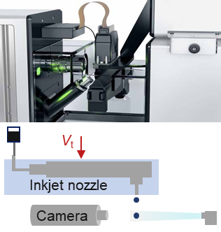

# Inverse Design - Dynamic Mode Decomposition (ID-DMD)
MATLAB and Python codes for the ID-DMD paper

Example Videos (Left: ID-DMD; Right: Ground true)

1-Airfoil

 _______ 

2-Jet flow

 _______ 

3-Cavity flow

 _______ 

4-Smoke

 _______ 

5-Droplet (Experimental test)

 _______ 
